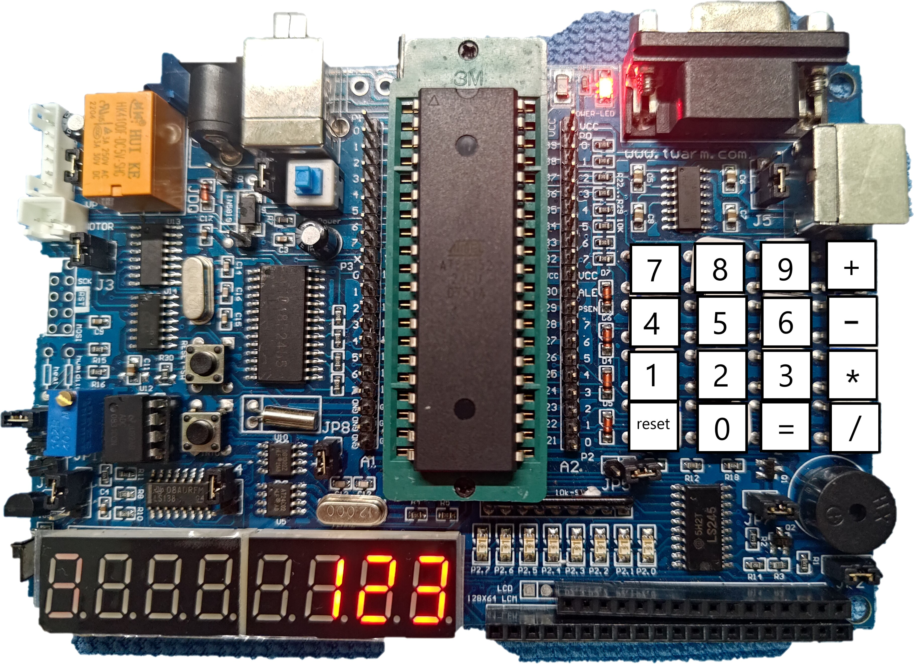
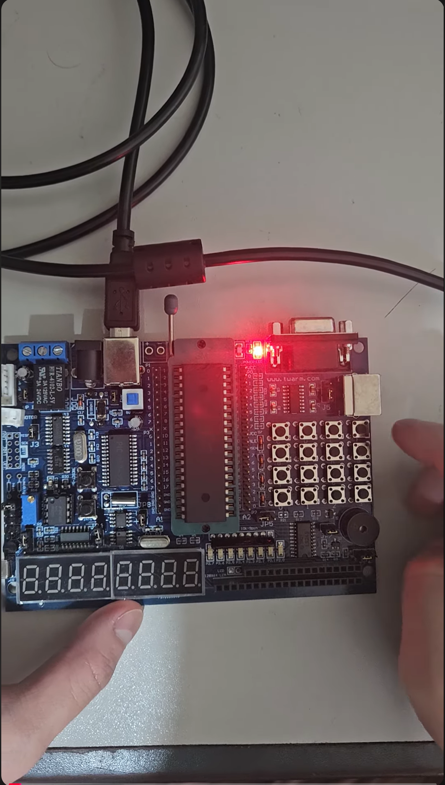

# 8051-Calculator (4x4 Keypad + 8-Digit 7-Segment)

用 8051 + 4x4 Keypad + 8 位七段顯示器實作的計算機專案。  
使用 **SDCC** + **Makefile** 編譯，進入 `src/` 後直接 `make` 就能產生 `.hex` 燒錄檔。

---

## 專案展示

### Keypad 位置示意圖


> 圖中的 `reset` 鍵對應程式的 `C`（清除 / 進位切換）。

### 完整 Demo 影片（YouTube）
[Watch on YouTube Shorts](https://youtube.com/shorts/_WM83jGysf0)

<a href="https://youtube.com/shorts/_WM83jGysf0">
  
</a>


---

## 功能特色（Features）

1. **0–9 數字輸入**、四則運算 `+ - * /`、清除/進位切換 `C`、計算/歷史 `=`
2. **連續運算（由左到右）**：可一直 `+ - * /` 接著算，最後按 `=` 顯示結果  
   - ※ 沒有乘除優先權（例如：`2 + 3 * 4` 會以 `(2+3)*4` 的方式計算）
3. **除以 0 錯誤顯示（Error）**，除法為**整數除法**
4. **支援負數運算**，也可輸入負數（負號輸入方式見下方操作說明）
5. **十進位結果轉換成 2 / 8 / 16 進制顯示**
   - 負數採 **補數（two’s complement）** 表示
   - 有範圍限制，超出會顯示 Error  
     - Binary（8-bit）：`-128 ~ 127`  
     - Octal / Hex：`-32767 ~ 32766`
6. **最近 10 次結果紀錄（History）**
   - 結果會存入最新一筆（最多保留 10 筆）
   - 可調出紀錄並用調出的數字繼續做運算

---

## Keypad Layout（按鍵對應）

本專案使用常見的 4x4 排列（示意如下）：

|      | Col0 | Col1 | Col2 | Col3 |
|------|------|------|------|------|
| Row0 |  7   |  8   |  9   |  +   |
| Row1 |  4   |  5   |  6   |  -   |
| Row2 |  1   |  2   |  3   |  *   |
| Row3 |  C   |  0   |  =   |  /   |

> 補充：七段顯示器上運算子可能會用字母形狀顯示（例如 `+` 類似 A、`*` 類似 H、`/` 類似 d），這是為了符合七段顯示器可呈現的段碼。

---

## 操作方式（How to Use / Demo 腳本）

### 1) 基本運算
1. 輸入 `num1`
2. 按運算子（`+ - * /`）
3. 輸入 `num2`
4. 按 `=` 顯示答案（並存入歷史紀錄）

### 2) 連續運算（左到右）
你可以這樣一直算下去：
- `12 + 3 * 4 =`
- 計算流程是左到右：
  - 先算 `12 + 3 = 15`
  - 再算 `15 * 4 = 60`

### 3) 除法與除以 0
- 除法是整數除法：例如 `7 / 2 = 3`
- 除以 0 會顯示 `Error`

### 4) 輸入負數（負號）
在「一開始」或「剛按完運算子」的狀態下：
- 先按 `-` 當作負號，再輸入數字  
  例：`- 5 + 2 =` 會得到 `-3`

### 5) 進位轉換（按 C 循環）
計算出結果（或從 History 調出結果）後，按 `C` 會循環切換顯示模式：

1. Clear / Reset
2. Binary（8 位）
3. Octal（6 位）
4. Hex（4 位）
5. 回到 Clear / Reset

> 負數以補數顯示；若數值超出範圍會顯示 `Error`。

### 6) 歷史紀錄（最近 10 筆）
- 按 `=` 計算成功後會存入最新一筆紀錄（最多 10 筆）
- 在非輸入新數字的狀態下，**連按 `=`** 會依序顯示：
  - `over[0] → over[1] → ... → over[9]`（超過就停在最舊那筆）
- 調出來的值可直接接著按 `+ - * /` 繼續運算

---

## 編譯方式（Build / Compile）

### 需求
- SDCC
- make
- packihx（通常 SDCC 會附）

### 編譯
在專案根目錄下：
```bash
cd src
make
```

輸出檔：
- `final_main.hex`（燒錄用）

### 清理（clean）
```bash
cd src
make clean
```

> 注意：`make clean` 在 Windows 可用（使用 `del`）。  
> 若在 Linux/macOS，請把 `src/Makefile` 的 `del` 改成 `rm -f`。

---

## 專案架構（Project Structure）

```
8051-Calculator/
├─ README.md                 # 專案說明、功能、操作方式、Demo 連結
├─ .gitignore                # 忽略 SDCC 編譯產物（.hex/.ihx/.rel...）
├─ assets/
│  ├─ keypad_layout.jpg      # Keypad 按鍵位置示意圖
│  └─ youtube_thumb.png      # YouTube Demo 縮圖（可點擊跳轉）
└─ src/
   ├─ final_main.c           # 主程式：運算/負數/Error/進位切換/History
   ├─ Keypad4x4.c            # 4x4 Keypad 掃描與按鍵回傳
   ├─ Keypad4x4.h            # Keypad 介面宣告
   ├─ LED_Display.c          # 七段顯示器段碼與顯示控制
   ├─ LED_Display.h          # 顯示器介面宣告
   ├─ delay.c                # 延遲函式（debounce/顯示刷新用）
   ├─ delay.h                # delay 介面宣告
   └─ Makefile               # SDCC 編譯腳本（輸出 final_main.hex）

```

